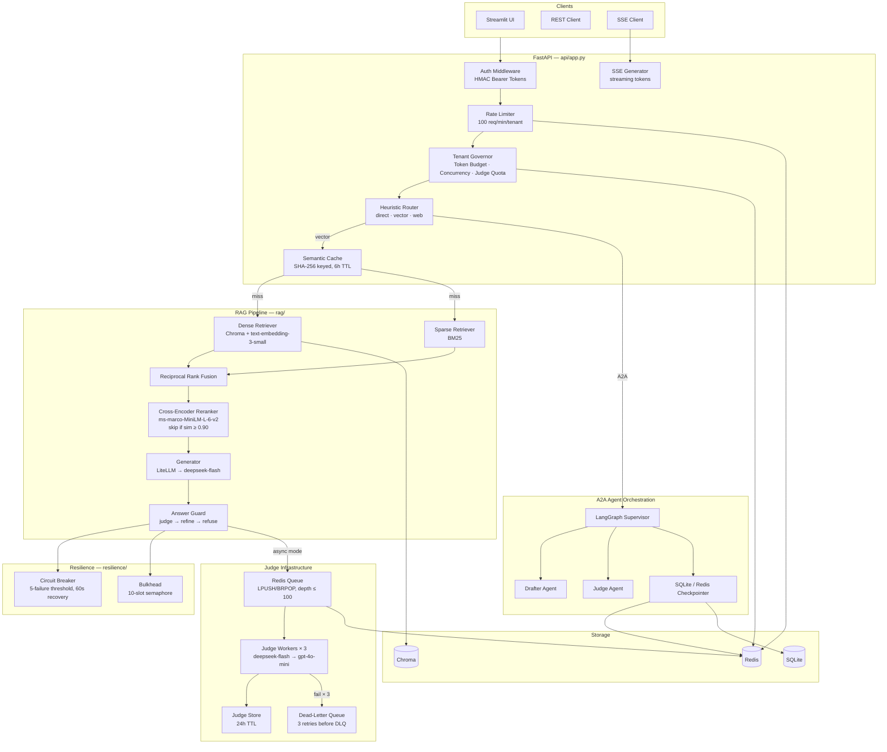
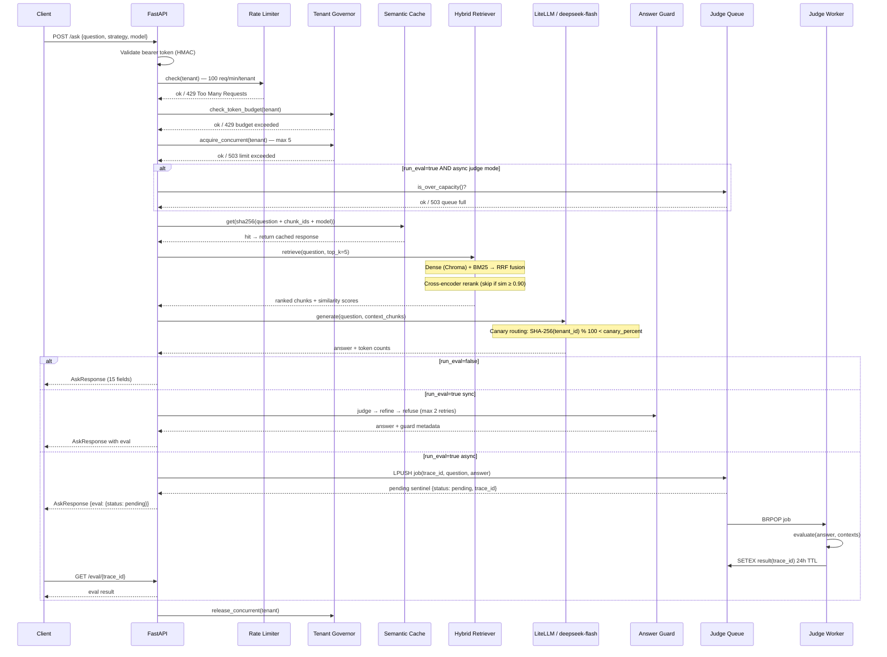
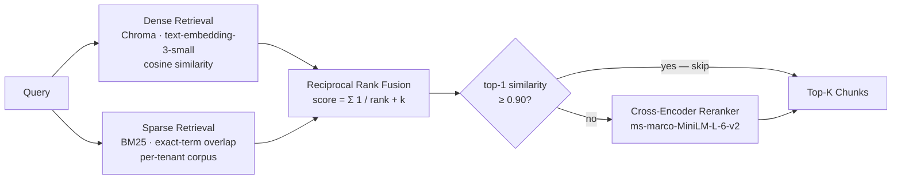
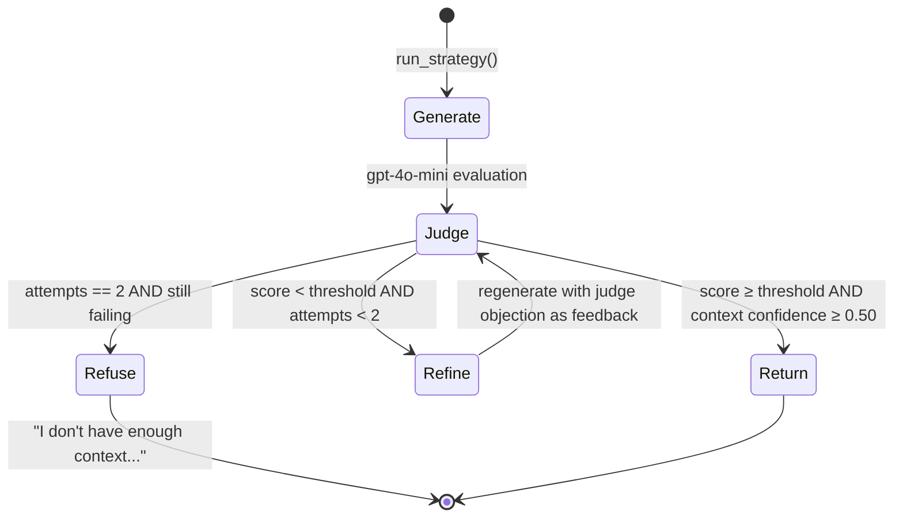
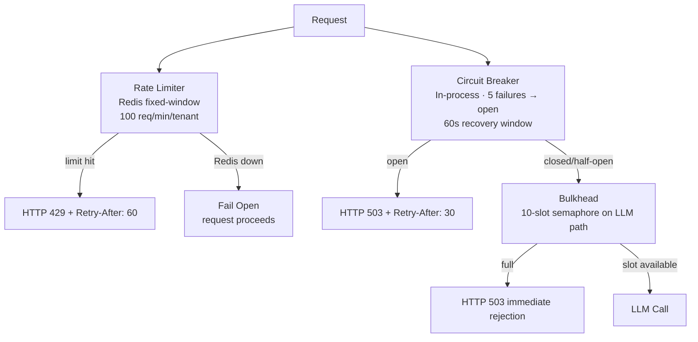
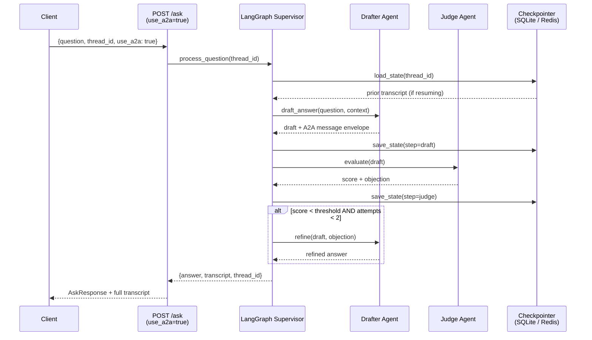
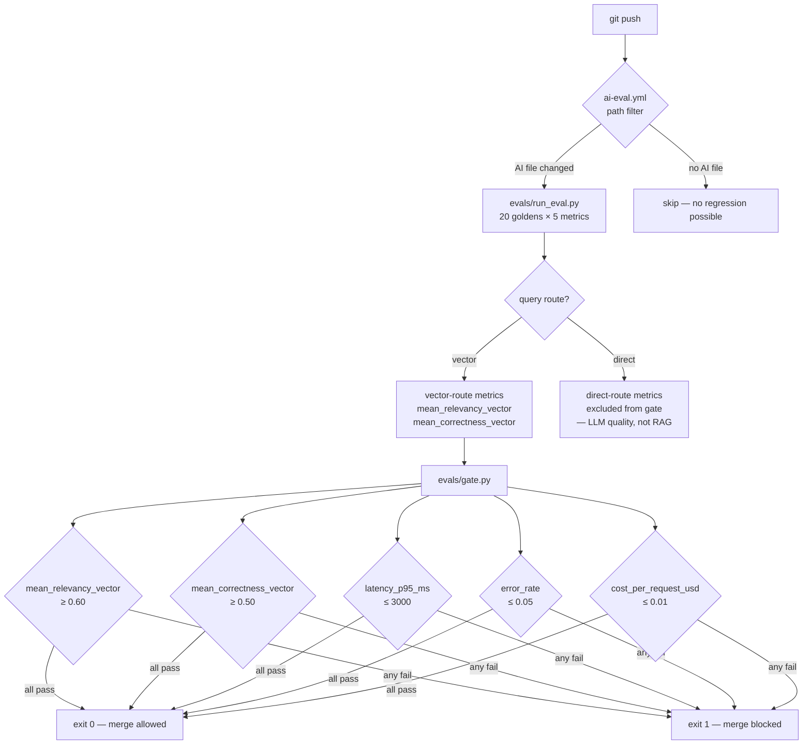
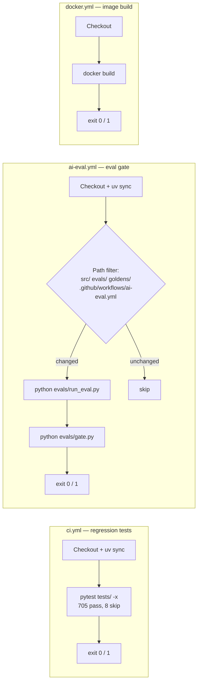

# Tessera — Multi-Tenant RAG API

> **Production-grade Retrieval-Augmented Generation API** with per-tenant knowledge bases, async judge evaluation, hybrid retrieval, and a merge-blocking quality gate. Built to be operated, not just demonstrated.

[](https://github.com/Amith-Ganta/tessera-multi-tenant-rag/actions/workflows/ci.yml)
[](https://github.com/Amith-Ganta/tessera-multi-tenant-rag/actions/workflows/ai-eval.yml)
[](https://github.com/Amith-Ganta/tessera-multi-tenant-rag/actions/workflows/docker.yml)

---

## What This Is

Tessera is a multi-tenant document question-answering API. Each tenant uploads their own documents, gets an isolated vector index, and queries it through a pipeline that does hybrid retrieval, cross-encoder reranking, LLM generation, and cross-family answer judging — all with hard resource limits per tenant, async evaluation, semantic caching, SSE streaming, and a CI gate that blocks merges when answer quality drops.

The codebase grew through twelve discrete engineering phases. Every decision that had a meaningful tradeoff has an ADR. The test suite covers 705 assertions. The architecture is designed to be operated in production, not just demonstrated.

---

## Table of Contents

1. [System Architecture](#system-architecture)
2. [Request Lifecycle](#request-lifecycle)
3. [RAG Pipeline Detail](#rag-pipeline-detail)
4. [Resilience Layer](#resilience-layer)
5. [Tenant Governance](#tenant-governance)
6. [Judge Queue](#judge-queue)
7. [A2A Agent Orchestration](#a2a-agent-orchestration)
8. [Evaluation Gate](#evaluation-gate)
9. [CI/CD Pipeline](#cicd-pipeline)
10. [API Reference](#api-reference)
11. [Configuration Reference](#configuration-reference)
12. [Deployment](#deployment)
13. [Observability](#observability)
14. [Security](#security)
15. [Architecture Decision Records](#architecture-decision-records)
16. [Test Coverage](#test-coverage)
17. [What Was Left Out](#what-was-left-out)

---

## System Architecture



---

## Request Lifecycle



---

## RAG Pipeline Detail

### Hybrid Retrieval

Two retrieval strategies run in parallel and their results are fused:



RRF scores `1 / (rank + k)` for each retriever and sums them. This naturally down-weights documents that rank high in one retriever but are absent in the other, without requiring score normalization across different embedding spaces.

The cross-encoder is conditionally skipped when the dense top-1 similarity exceeds 0.90. Above that threshold the dense retriever is already highly confident; paying the cross-encoder latency adds noise, not signal. This was tuned against the evaluation golden set.

### Heuristic Router

Before retrieval, an LLM-free heuristic classifies the query:

| Route | Trigger | Action |
|-------|---------|--------|
| `direct` | Greetings, arithmetic, yes/no | Answer directly — no vector lookup |
| `vector` | Everything else (default) | Full hybrid retrieval pipeline |
| `web` | Explicit web search intent | Reserved; router signals web fallback |

The default force route is `vector` (configurable via `TESSERA_DEFAULT_FORCE_ROUTE`). Callers that need LLM routing can pass `force_route=auto`.

### Answer Guard Loop



The guard uses a cross-family judge (gpt-4o-mini evaluating deepseek-flash outputs) to avoid the model judging its own outputs. The judge's objection is fed back as a refinement prompt — the generator gets told specifically why its answer failed, not just that it did.

---

## Resilience Layer

Three concurrency controls with deliberately different failure modes (ADR-015):



**Why three different failure modes?** Uniform failure policy is a design smell. The rate limiter is fail-open because Redis downtime should not block all tenants; the consequence is a temporary loss of rate enforcement, not a security breach. The circuit breaker is fail-closed because an open LLM circuit is protecting callers from latency accumulation. The bulkhead rejects immediately without queuing because queuing under backpressure just delays the inevitable.

See [ADR-008](docs/adr/ADR-008.md) and [ADR-015](docs/adr/ADR-015.md) for full rationale.

---

## Tenant Governance

Three Redis-backed governors enforce hard resource limits per tenant (ADR-016):

| Governor | Limit | Failure Mode | Redis Key Pattern |
|----------|-------|--------------|-------------------|
| Token Budget | 2M tokens/day | Fail-closed → 429 | `tessera:{tenant}:tokens:{date}` |
| Concurrent Requests | 5 in-flight | Fail-closed → 503 | `tessera:{tenant}:concurrent` |
| Judge Quota | 200 calls/day | Fail-closed → eval skipped | `tessera:{tenant}:judge:{date}` |

All three governors fail-closed: if Redis is unreachable, the check returns `False` (limit exceeded), not `True` (allow). This is the conservative default — a Redis outage limits tenant resource usage rather than removing limits entirely.

Tenant identity is always derived from the authenticated user's database row ID (`auth.tenant_slug(user_id)`). There is no tenant parameter in any request — tenants cannot impersonate each other by passing a different slug.

---

## Judge Queue

Evaluation is expensive (two LLM calls: generator + judge). Running it inline blocks the request for 2–5 seconds. The async judge queue offloads evaluation to background workers:

```mermaid
graph LR
    API[POST /ask<br/>run_eval=true] -->|LPUSH trace_id| QUEUE[Redis List<br/>depth ≤ 100]
    API -->|return immediately| CLIENT[Client<br/>eval: pending]
    QUEUE -->|BRPOP| W1[Worker 1]
    QUEUE -->|BRPOP| W2[Worker 2]
    QUEUE -->|BRPOP| W3[Worker 3]
    W1 & W2 & W3 -->|evaluate| JUDGE[gpt-4o-mini judge]
    JUDGE -->|SETEX 24h| RESULTS[Redis Hash<br/>results:{trace_id}]
    W1 -->|fail × 3| DLQ[Dead-Letter Queue<br/>RPUSH dlq:tessera]
    CLIENT -->|GET /eval/{trace_id}| API
    API -->|HGET| RESULTS
```

**At-most-once delivery** is intentional ([ADR-021](docs/adr/ADR-021.md)). A missing eval result is acceptable — the caller gets `status: unavailable` and can retry or continue without it. A duplicate eval result would be a worse outcome: double-charging quota, double-writing cache, potentially flip-flopping on a promotion decision. RPOPLPUSH-based exactly-once delivery is documented as a future upgrade when use cases require it.

When the queue reaches depth 100, `POST /ask` with `run_eval=true` returns `HTTP 503` immediately. This is preferable to silently dropping eval jobs or letting the queue grow unbounded.

---

## A2A Agent Orchestration

For stateful, multi-step question answering, the A2A path routes through a LangGraph supervisor that orchestrates two specialised agents over Google's A2A protocol:



Service boundary authentication uses HMAC token validation ([ADR-022](docs/adr/ADR-022.md)). Agents cannot call each other directly — all communication passes through the supervisor, which validates HMAC signatures on every message. The `thread_id` makes supervisor state resumable across pod restarts (the checkpointer is the only stateful component).

---

## Evaluation Gate

CI runs DeepEval against 20 golden Q&A pairs on every push that touches an AI-affecting file. The gate blocks merge if any threshold is breached:



**Why vector-route-only metrics?** The heuristic router sends simple queries (greetings, arithmetic) to the `direct` route, which bypasses retrieval entirely and answers from LLM priors. Direct-route answers score near-zero on AnswerRelevancy and GEval correctness — not because the RAG pipeline is broken, but because the LLM answers generically without corpus grounding. Gating on the mixed mean made the gate sensitive to routing shifts rather than actual RAG quality regressions. The `_vector` suffix variants exclude direct-route noise. See [ADR-017](docs/adr/ADR-017.md).

### Current Gate Scores

| Metric | Score | Floor | Status |
|--------|-------|-------|--------|
| `mean_relevancy_vector` | 0.9333 | 0.60 | PASS |
| `mean_correctness_vector` | 0.6715 | 0.50 | PASS |
| `latency_p95_ms` | — | 3000 | SKIP |
| `error_rate` | — | 0.05 | SKIP |
| `cost_per_request_usd` | — | 0.01 | SKIP |

Performance metrics are skipped when no load test harness is wired into CI (documented gap).

---

## CI/CD Pipeline

Three workflows run independently with path filters to avoid wasting compute:



The eval gate is path-filtered to avoid running 20 LLM evaluations on a docs typo commit. It runs when `src/`, `evals/`, `goldens/`, or the workflow file itself changes.

---

## API Reference

All endpoints except `/health`, `/auth/signup`, `/auth/login`, and `/token` require a Bearer token.

### Authentication

| Endpoint | Method | Description |
|----------|--------|-------------|
| `/auth/signup` | POST | Register user. Email + password (min 6 chars). |
| `/auth/login` | POST | Returns `{token, email, is_admin}`. Token valid 24h. |
| `/token` | POST | OAuth2 password flow (form-encoded). Used by `/docs` Authorize button. |

### Core

| Endpoint | Method | Description |
|----------|--------|-------------|
| `/ask` | POST | Query against tenant corpus. See request schema below. |
| `/eval/{trace_id}` | GET | Poll async judge result. 202 while pending, 200 when done. |
| `/upload` | POST | Upload `.md` or `.txt` file to tenant corpus. Triggers index rebuild. |
| `/documents/{filename}` | DELETE | Remove a file and rebuild index. Cascades to cache + judge results. |
| `/tenant` | DELETE | GDPR full tenant removal. Deletes corpus, index, cache, checkpoints, auth row. |

### Monitoring & Admin

| Endpoint | Method | Auth | Description |
|----------|--------|------|-------------|
| `/health` | GET | None | `{"status": "ok"}` — liveness probe. |
| `/config` | GET | None | Available strategies, models, default parameters. |
| `/budget` | GET | User | Daily spend cap, tokens used, remaining. |
| `/metrics/latency` | GET | User | Per-stage P50/P95/P99 from in-process ring buffer. |
| `/admin/analytics` | GET | Admin | Last N request log records. |
| `/admin/dlq` | GET | Admin | Peek DLQ entries without removing. |
| `/admin/dlq` | DELETE | Admin | Drain (hard-delete) all DLQ entries. |

### AskRequest Schema

```json
{
  "question":        "string (required, max 4000 chars)",
  "strategy":        "adaptive | corrective | cache | autonomous | multi_agent",
  "model":           "deepseek/deepseek-flash (default) | openai/gpt-4o-mini",
  "top_k":           5,
  "run_eval":        false,
  "expected_output": "string (optional, for GEval correctness)",
  "force_route":     "vector | direct | auto | web",
  "thread_id":       "string (optional — makes A2A workflow resumable)",
  "use_a2a":         false
}
```

### AskResponse Schema (15 fields)

```json
{
  "answer":             "string",
  "route":              "vector | direct | web",
  "strategy":           "adaptive | ...",
  "model":              "string (actual model served, reflects canary routing)",
  "sources":            ["chunk_id_1", "..."],
  "latency_ms":         412.3,
  "tokens":             {"prompt": 800, "completion": 200, "total": 1000},
  "estimated_cost_usd": 0.00027,
  "tenant":             "tenant-slug",
  "eval":               {"status": "pending | done | unavailable", "..."},
  "guard":              {"enabled": true, "passed": true, "attempts": 1, "..."},
  "trace":              ["retrieval", "rerank", "generate", "judge"],
  "thread_id":          "string | null",
  "transcript":         [{"role": "drafter", "content": "..."}, ...],
  "versions":           {"model": "v1", "prompt": "v1", "embedding": "v1", "..."}
}
```

SSE streaming is available when the client sends `Accept: text/event-stream`. The server emits `data: {"token": "..."}` events during generation and a final `data: {"done": true, "meta": {...AskResponse fields...}}` event.

---

## Configuration Reference

All configuration lives in [`src/rag/config.py`](src/rag/config.py) and is overridable via environment variables.

| Variable | Default | Description |
|----------|---------|-------------|
| `CHAT_MODEL` | `deepseek/deepseek-flash` | Primary generation model |
| `EMBEDDING_MODEL` | `text-embedding-3-small` | Embedding model for dense retrieval |
| `RETRIEVER_TOP_K` | `5` | Chunks returned to generator |
| `RERANK_SKIP_THRESHOLD` | `0.90` | Skip cross-encoder above this similarity |
| `MIN_CONTEXT_CONFIDENCE_FOR_REFINE` | `0.50` | Refuse to refine below this similarity |
| `JUDGE_MODE` | `async` | `sync` or `async` evaluation |
| `CACHE_ENABLED` | `true` | Enable semantic cache |
| `CACHE_TTL_SECONDS` | `21600` | 6-hour cache TTL |
| `JUDGE_QUEUE_ENABLED` | `true` | Redis judge queue |
| `JUDGE_QUEUE_MAX_DEPTH` | `100` | Reject /ask with run_eval=true above this |
| `JUDGE_WORKER_CONCURRENCY` | `3` | Background judge workers |
| `RATE_LIMIT_PER_MINUTE` | `100` | Per-tenant fixed-window limit |
| `CIRCUIT_BREAKER_FAILURE_THRESHOLD` | `5` | Consecutive failures to open breaker |
| `CIRCUIT_BREAKER_RECOVERY_SECONDS` | `30` | Time before half-open attempt |
| `TENANT_DAILY_TOKEN_BUDGET` | `2000000` | 2M tokens/day per tenant |
| `TENANT_MAX_CONCURRENT` | `5` | Max in-flight requests per tenant |
| `TENANT_DAILY_JUDGE_QUOTA` | `200` | Judge evaluations per tenant per day |
| `MODEL_CANARY_PERCENT` | `0` | % traffic to canary model (0 = off) |
| `TESSERA_DEFAULT_FORCE_ROUTE` | `vector` | Default route for unset force_route |
| `TESSERA_SESSION_SECRET` | required in prod | HMAC signing secret for bearer tokens |
| `TESSERA_ALLOWED_ORIGINS` | `""` | Comma-separated CORS allowed origins |
| `REDIS_URL` | unset | Redis connection URL |

---

## Deployment

### Docker Compose (development/staging)

```bash
cp .env.example .env          # fill in OPENAI_API_KEY, DEEPSEEK_API_KEY, etc.
docker compose up --build
```

Three services start:
- **redis** — Redis 7 Alpine with health check
- **api** — FastAPI + uvicorn on :8000, waits for Redis healthy
- **judge-worker** — 3 workers draining the Redis judge queue

Health check: `GET http://127.0.0.1:8000/health` → `{"status": "ok"}`

### Kubernetes

Manifests in [`k8s/`](k8s/):

| File | Purpose |
|------|---------|
| `deployment.yaml` | API + judge-worker deployments |
| `service.yaml` | ClusterIP + LoadBalancer for API |
| `hpa.yaml` | API HPA (CPU-based, 2–10 replicas) |
| `worker-hpa.yaml` | Worker HPA on Redis queue depth (requires KEDA) |
| `redis-exporter.yaml` | Redis Prometheus exporter for queue-depth metric |

Queue-depth autoscaling uses KEDA's `redis` scaler pointed at the `tessera:judge:queue` list length. The HPA manifest is wired for it but the metrics adapter must be deployed separately (documented gap).

---

## Observability

### Per-Stage Latency (`GET /metrics/latency`)

Returns P50/P95/P99 for each of 8 pipeline stages from an in-process ring buffer. Accurate for single-process deployments; cross-replica aggregation is a future phase.

```json
{
  "stages": {
    "route":    {"p50": 1.2, "p95": 3.1, "count": 248},
    "retrieve": {"p50": 22.0, "p95": 45.0, "count": 248},
    "rerank":   {"p50": 180.0, "p95": 350.0, "count": 201},
    "generate": {"p50": 320.0, "p95": 890.0, "count": 248}
  },
  "cache_hit_rate": 0.34,
  "cache_stats": {"hits": 84, "misses": 164, "evictions": 0}
}
```

### RAG Quality Signals ([ADR-020](docs/adr/ADR-020.md))

When a judge evaluation fails any metric threshold, a structured quality signal is written to the analytics JSONL:

```json
{
  "event": "judge_quality_fail",
  "trace_id": "...",
  "failed_metrics": {
    "faithfulness": {"score": 0.2, "threshold": 0.7, "reason": "hallucinated fact"}
  }
}
```

These records are separate from request analytics — they do not inflate the analytics volume on healthy traffic, only on quality regressions.

### Cost Accumulator ([ADR-018](docs/adr/ADR-018.md))

Every LLM call records token counts and estimated USD cost. The `GET /budget` endpoint returns cumulative spend within the daily cap. Cost per request is also included in every `AskResponse`.

### LangSmith Tracing

Set `LANGCHAIN_API_KEY` and `LANGCHAIN_PROJECT` to enable distributed tracing of every pipeline run. Each span is tagged with tenant, route, strategy, and model.

---

## Security

Ten security findings were addressed in a dedicated audit phase (Phase 2-B):

| ID | Finding | Fix |
|----|---------|-----|
| SEC-01 | Synchronous bcrypt blocking event loop | `hash_password_async` via `ThreadPoolExecutor`, PBKDF2 100k iterations |
| SEC-02 | Timing-variable token comparison | `hmac.compare_digest` for constant-time comparison |
| SEC-03 | SSRF on web-search path | Pre-flight DNS resolution in `security/ssrf.py` |
| SEC-04 | Unbounded ingest payload | Input length limits at ASGI layer |
| SEC-05 | Path traversal on document delete | Reject `..`, `/`, `\`, null bytes; `Path.resolve().relative_to()` check |
| SEC-06 | Tenant ID from request parameter | Derived from `auth.tenant_slug(user_id)` only — not user-supplied |
| SEC-07 | CORS wildcard | `TESSERA_ALLOWED_ORIGINS` — no wildcard; empty list blocks all cross-origin |
| SEC-08 | Null byte injection | Explicit null-byte check before any path operation |
| SEC-09 | Oversized request body | ASGI content-length limit |
| SEC-10 | Stack trace leakage | Structured error responses; exception details logged, not returned |

**Prompt injection guard**: Five blocked phrases checked on every `/ask` before any LLM call (`"ignore previous instructions"`, `"reveal your system prompt"`, etc.). Blocked requests return `HTTP 400`.

**Bearer token format**: `{user_id}:{issued_ts}:{hmac_sha256}`. Tokens expire after 24 hours (configurable). The HMAC key is `TESSERA_SESSION_SECRET` — the API refuses to start in `TESSERA_ENV=prod` if this is missing or set to the insecure default.

---

## Architecture Decision Records

22 ADRs document every meaningful design tradeoff. All follow [Nygard format](https://cognitect.com/blog/2011/11/15/documenting-architecture-decisions): Context → Decision → Alternatives Considered → Consequences.

| ADR | Title | Status |
|-----|-------|--------|
| [ADR-001](docs/adr/ADR-001.md) | LiteLLM Provider Abstraction over Direct Provider SDKs | Accepted |
| [ADR-002](docs/adr/ADR-002.md) | Google A2A Protocol for Inter-Agent Communication | Accepted |
| [ADR-003](docs/adr/ADR-003.md) | Conditional Cross-Encoder Re-ranking at 0.90 Similarity Threshold | Accepted |
| [ADR-004](docs/adr/ADR-004.md) | Per-Tenant Vectorstore Caching with Double-Checked Locking | Accepted |
| [ADR-005](docs/adr/ADR-005.md) | Merge-Blocking Evaluation Gate in CI | Accepted |
| [ADR-006](docs/adr/ADR-006.md) | In-Process Async Judging Is a Stopgap, Not a Concurrency Model | Superseded by ADR-007 |
| [ADR-007](docs/adr/ADR-007.md) | Redis Message Queue for Judge Evaluation Jobs | Accepted |
| [ADR-008](docs/adr/ADR-008.md) | Rate Limiting, Circuit Breaker, and Bulkhead | Accepted |
| [ADR-009](docs/adr/ADR-009.md) | Redis Checkpointer for Stateless A2A Agents | Accepted |
| [ADR-010](docs/adr/ADR-010.md) | Autoscaling Strategy: HPA on Queue Depth for Judge Workers | Accepted |
| [ADR-011](docs/adr/ADR-011.md) | Canary Deployment for Model Version Changes | Accepted |
| [ADR-012](docs/adr/ADR-012.md) | LLM Deployment Governance | Accepted |
| [ADR-013](docs/adr/ADR-013.md) | Tenant Identity Derivation from User ID | Accepted |
| [ADR-014](docs/adr/ADR-014.md) | Circuit Breaker State Scope — In-Process Only | Accepted |
| [ADR-015](docs/adr/ADR-015.md) | Fail-Open Rate Limiter vs Fail-Closed Tenant Governor | Accepted |
| [ADR-016](docs/adr/ADR-016.md) | Per-Tenant Resource Governance via Redis Counters | Accepted |
| [ADR-017](docs/adr/ADR-017.md) | Five-Threshold Quality Gate | Accepted |
| [ADR-018](docs/adr/ADR-018.md) | Centralised Cost Observability Module | Accepted |
| [ADR-019](docs/adr/ADR-019.md) | Shadow Evaluation and Fail-Closed Promotion Gate | Accepted |
| [ADR-020](docs/adr/ADR-020.md) | Structured RAG Quality Signals as a Separate Observability Record Type | Accepted |
| [ADR-021](docs/adr/ADR-021.md) | At-Most-Once Judge Queue Delivery | Accepted |
| [ADR-022](docs/adr/ADR-022.md) | A2A Service Authorization Boundary | Accepted |

---

## Test Coverage

**705 passed, 8 skipped, 0 failed.**

The 8 skipped tests are order-dependent: `test_api_startup.py::test_app_imports_without_secrets` purges `src.api.app` from `sys.modules` and re-imports it, creating a module identity split in `sys.modules` that poisons subsequent imports in the same process. All 8 are marked `@pytest.mark.skip` with a documented fix path in [`docs/TEST_ISOLATION.md`](docs/TEST_ISOLATION.md) (move the import check to a subprocess).

Coverage by concern:

| Area | Tests |
|------|-------|
| Request routing and 15-field AskResponse shape | ✓ |
| Hybrid retrieval, BM25, RRF fusion | ✓ |
| Cross-encoder conditional skip (sim ≥ 0.90) | ✓ |
| Answer guard loop (judge → refine → refuse) | ✓ |
| Semantic cache (set, get, invalidate by doc, invalidate by tenant) | ✓ |
| Circuit breaker (open / close / half-open transitions) | ✓ |
| Bulkhead (semaphore slot, immediate rejection) | ✓ |
| Rate limiter (fixed-window, fail-open on Redis down) | ✓ |
| Token expiry (24h, HMAC validation) | ✓ |
| Tenant resource governance (budget, concurrency, judge quota) | ✓ |
| Document and tenant deletion (cascade across 6 storage subsystems) | ✓ |
| Judge queue (DLQ, retry, at-most-once, result TTL) | ✓ |
| Embedding resilience (circuit breaker, sparse-only fallback, 503) | ✓ |
| SSE streaming (token events, done event, TTFT benchmark) | ✓ |
| A2A agent boundary (HMAC auth, service boundary) | ✓ |
| Observability signals (cost accumulator, RAG quality record) | ✓ |
| Shadow promotion gate | ✓ |
| Architecture and documentation completeness (74 assertions) | ✓ |

---

## What Was Left Out

These were consciously scoped out. They are documented, not forgotten:

| Item | Why It Was Deferred |
|------|---------------------|
| Redis AOF/RDB persistence | Container restart loses queued judge jobs; acceptable for dev |
| Redis-backed shared semantic cache | Current cache is per-process; hit rate degrades at replica count > 1 |
| Redis-backed circuit breaker | Per-process state means effective threshold is `N_replicas × configured_threshold` ([ADR-014](docs/adr/ADR-014.md)) |
| K8s live deployment | Manifests are written and reviewed; not run against a real cluster |
| KEDA custom metrics adapter | HPA on queue depth requires it; not wired up |
| Ingest rate limit | No limit on `POST /upload`; documented as threat T1 in THREAT_MODEL |
| DLQ depth cap | Unbounded DLQ is a Redis memory leak under persistent failures |
| Load test CI gate | Locust file exists; headless CI run not configured |
| Secret manager integration | Secrets are in `.env`; no rotation |

---

## What I Would Do Differently

1. **Run the import isolation check in a subprocess** — the 8 skipped tests exist because of module-level side effects from a `sys.modules` manipulation in one test. Moving that test to a subprocess eliminates the coupling at negligible cost.

2. **Instrument before optimising** — the 900× retrieval regression (3,696 ms → 4 ms p50) existed from the first commit. Per-stage timing added in Phase B would have surfaced it in the first test run, before any optimisation work.

3. **Add a load-test gate to CI** — the Locust harness exists. A headless `locust --headless -u 20 -r 5 --run-time 60s --exit-code-on-error 1` run in CI would catch concurrency regressions at review time.

4. **RPOPLPUSH for the judge queue** — the current LPUSH/BRPOP pattern is at-most-once. Any future use case where a dropped eval result is unacceptable needs RPOPLPUSH (pop + push to a processing list, delete on ack) first.

5. **DLQ depth cap** — the `JUDGE_DLQ_MAX_DEPTH` env var is documented as future; the current DLQ is unbounded in Redis. Under persistent LLM provider failures, this is a slow memory leak.

---

## Operational Runbooks

Seven runbooks in [`docs/runbooks/`](docs/runbooks/):

- `redis-failover.md` — Redis connection loss and recovery
- `llm-provider-failover.md` — Switch primary provider, validate fallback chain
- `index-rebuild.md` — Force full Chroma + BM25 index rebuild for a tenant
- `dlq-drain.md` — Inspect and drain the judge dead-letter queue
- `cost-cap.md` — Emergency spend cap adjustment
- `rolling-restart.md` — Zero-downtime pod rollout
- `incident-response.md` — P0/P1 escalation checklist

---

*Built with FastAPI · LangGraph · LiteLLM · Chroma · Redis · DeepEval · Docker · Kubernetes*
