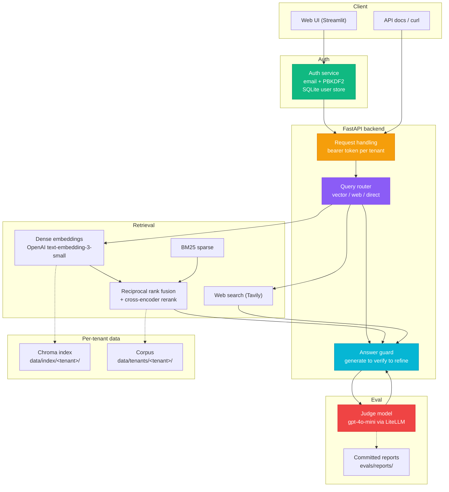
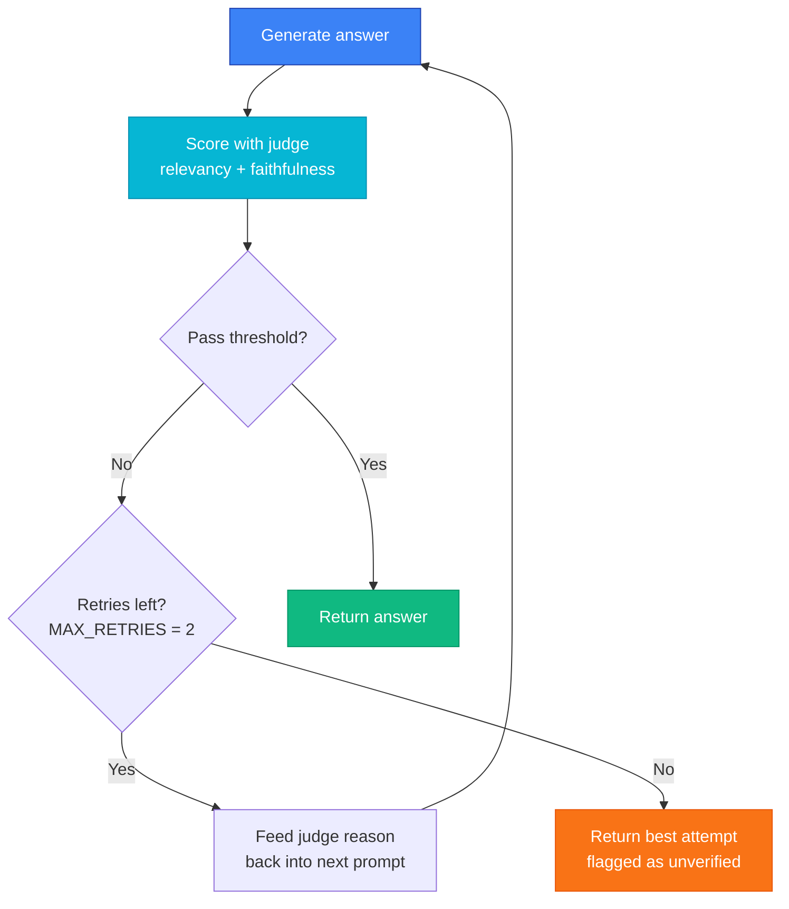
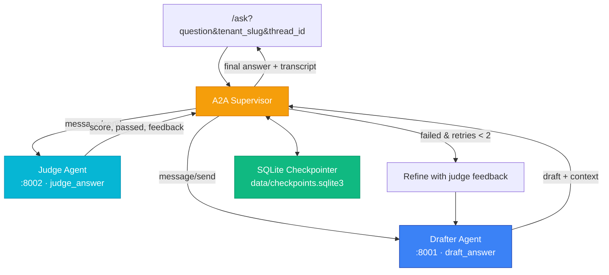
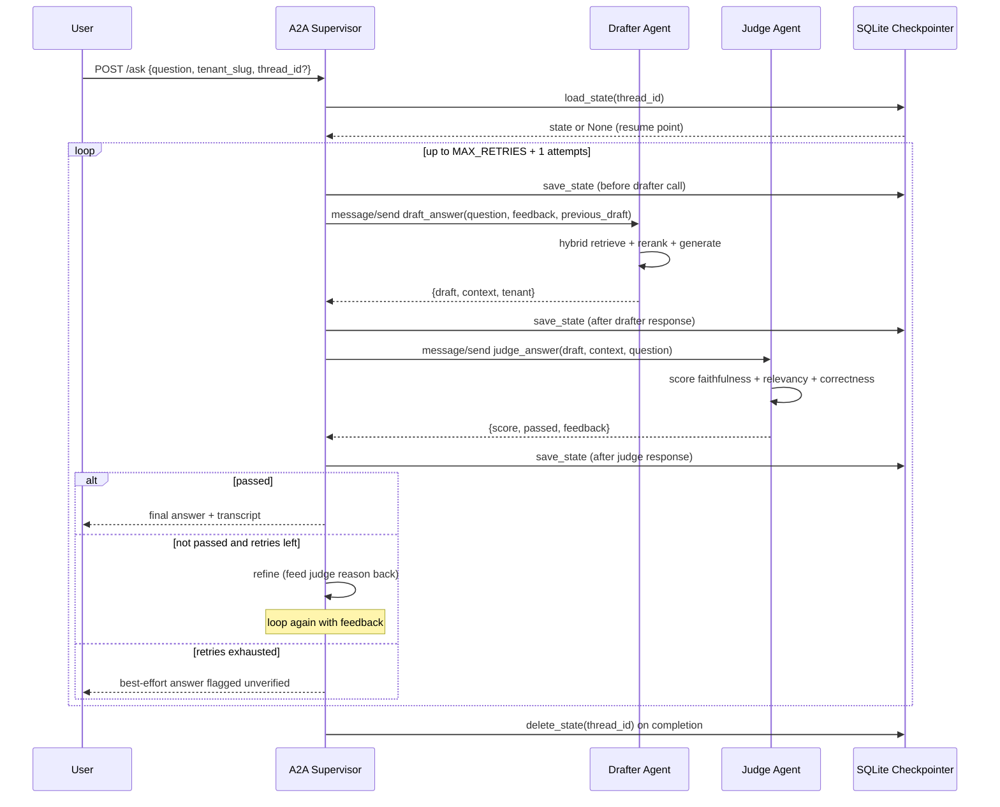
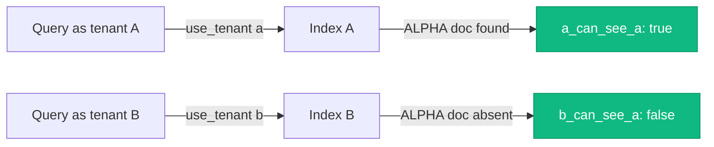

# Tessera: Multi-Tenant Agentic RAG for Compliance Q&A

A retrieval-augmented question-answering service for security and compliance documents. It routes each question to the right retrieval strategy, grounds the answer in a per-tenant corpus, checks the answer against a judge model before returning it, and gates its own quality in CI. Every metric quoted below is read straight from a committed report file, not rounded up for effect.

See [docs/CASE_STUDY.md](docs/CASE_STUDY.md) for the problem definition, architecture decisions, evaluation evidence, and operational readiness notes.

[](https://www.python.org/downloads/)
[](https://fastapi.tiangolo.com/)
[](https://streamlit.io/)
[](LICENSE)

---

## What this is

Tessera answers questions against a corpus of compliance notes (access control, encryption, GDPR, SOC 2, PCI DSS, Kubernetes network policy, and so on). It is built to show a few things working together honestly:

- **Hybrid retrieval** that combines dense embeddings with BM25 and reranks the result.
- **A query router** that picks one of three strategies per question (local vector search, live web search, or direct model knowledge).
- **A generate then verify then refine guard loop** that scores each answer with a judge model and retries a bounded number of times when the answer is not grounded or not relevant.
- **Per-tenant isolation** so one tenant's corpus and index are never visible to another.
- **A CI eval gate** that runs DeepEval on a fixed set of golden questions and blocks a merge if the mean scores fall below a floor.

It is a portfolio project, not a hosted product. Where a claim is honestly "proven at the retrieval layer" rather than "cryptographically guaranteed end to end", the README says so.

---

## Measured results

These numbers come from `evals/reports/latest.json`, produced by `evals/run_eval.py` over the 12 golden questions in `goldens/retriever_goldens.json`. The judge model is `gpt-4o-mini`.

| Metric | Mean | Pass rate | Threshold |
|--------|------|-----------|-----------|
| Answer relevancy | 0.917 | 11/12 | 0.7 per case |
| Correctness (GEval) | 0.786 | 11/12 | 0.5 per case |
| Faithfulness | 0.889 | 8/12 counted | 0.7 per case |
| Context precision | 1.000 | 12/12 | 0.7 per case |
| Context recall | 1.000 | 12/12 | 0.7 per case |

Notes on the honest edges of this table:

- One question (`g11`, infrastructure-as-code drift) was routed to the direct strategy with no retrieval context, so the model answered "I do not know". That case fails relevancy and correctness. It is a real routing miss, kept in the report rather than hidden.
- Faithfulness is only defined when a case has retrieval context. Five direct-route cases are skipped for it, and one vector case timed out against the judge, so faithfulness is scored on 6 of 12 cases. Two of those six (`g8` PCI DSS, `g10` Kubernetes network policy) fell to 0.67 and count as fails.
- Context precision and recall are 1.0 because the retriever surfaces the correct source node first on every vector-routed question in this set.

The CI gate (`evals/gate.py`) checks the aggregate, not the per-case pass rate: it requires mean relevancy at or above 0.6 and mean correctness at or above 0.5. The current run clears both.

### A2A and operations metrics

The A2A orchestration layer and the SQLite checkpointer are measured by `evals/a2a_metrics.py`, whose output is committed at `evals/reports/a2a_implementation_metrics.json`. The live numbers below come from a 3-question run against the `user-guardproof` tenant (the full 12-file compliance corpus), with the real Drafter and Judge agents.

| Metric | Value | Source |
|--------|-------|--------|
| A2A success rate | **100%** (3/3 passed) | `a2a_implementation_metrics.json` |
| A2A retry rate | **0%** | `a2a_implementation_metrics.json` |
| A2A unverified rate | **0%** | `a2a_implementation_metrics.json` |
| Checkpointer write latency | ~0.04 s avg (12 samples) | `a2a_implementation_metrics.json` |
| Checkpointer read latency | ~0.07 s avg (3 samples) | `a2a_implementation_metrics.json` |
| Fallback recovery time | ~2.3 s (full detect → recover) | `a2a_implementation_metrics.json` |
| Judge call latency | ~218 s avg (5–7 DeepEval metrics) | `a2a_implementation_metrics.json` |
| Drafter call latency | ~146 s avg (retrieve + rerank + generate) | `a2a_implementation_metrics.json` |
| Avg cost per question | $0.00025 | `metrics_summary.json` |
| Avg / p95 latency | 11.2 s / 13.9 s (router-on) | `metrics_summary.json` |
| Tenant isolation | `isolation_holds: true`, 0 cross-tenant reads | `tenancy_isolation.json` |

Two honest read-outs from that table: the **judge dominates end-to-end latency** (DeepEval runs 5–7 gpt-4o-mini metrics sequentially per attempt), and **fallback recovery is dominated by failure detection**, not by the in-process retry itself. Both are called out in the deep-dive below rather than hidden.

---

## Architecture



### The generate to verify to refine loop

This is the core reliability mechanism. It lives in `src/rag/answer_guard.py` and wraps generation so no answer is returned before it has been scored.



When the loop exhausts its retries, it returns the best attempt and marks it as unverified rather than pretending it passed. The judge's own reason string becomes the feedback for the next attempt, so a refinement is targeted at the actual failure rather than a blind retry.

### Agent-to-Agent (A2A) orchestration and durable checkpoints

The guard loop is also exposed as an **official Google A2A (Agent-to-Agent)** protocol workflow, with the Drafter and Judge running as standalone A2A agent servers and a supervisor orchestrating them over the wire.

- **`src/agents/drafter_agent.py`** — an A2A server exposing the `draft_answer` skill. It accepts `question`, `tenant_slug`, `feedback`, and `previous_draft`, scopes retrieval to the tenant, and returns `{"draft", "context", "tenant"}`.
- **`src/agents/judge_agent.py`** — an A2A server exposing the `judge_answer` skill. It reuses the guard's judge logic (`src/rag/answer_guard.judge_draft`) to score faithfulness, correctness, and relevancy, and returns `{"score", "passed", "feedback"}`.
- **`src/orchestrator/a2a_supervisor.py`** — the A2A client that drives `Drafter -> Judge -> Feedback -> Refine` (max 2 retries), returns the final answer plus the full transcript, and falls back to in-process execution of the same skills if an agent is unreachable.
- **`src/rag/checkpointer.py`** — a `SQLiteCheckpointer` that persists the full workflow state (transcript, retries, last draft, question, tenant, created-at) as a JSON document keyed by `thread_id`.

The A2A protocol is implemented directly against the specification — **AgentCard discovery** at `GET /.well-known/agent.json` and **JSON-RPC 2.0** `message/send` at `POST /` — so the agents interoperate with any standards-compliant A2A client while running on the project's existing dependency set. The official `a2a-sdk` is declared in `pyproject.toml`/`requirements.txt` for teams that prefer the SDK client.

#### Why a SQLite checkpointer?

The previous loop kept all state in memory: a pod restart, a provider fallback (DeepSeek -> OpenAI), or a long-running workflow silently dropped the transcript and retry count. The checkpointer makes the workflow **resumable** — the supervisor saves state before every LLM call and after every agent response, and on a provider failure it reloads the last saved state and retries from there. When a request supplies a `thread_id`, `/ask` resumes that exact thread instead of starting over.



The exchange between the supervisor and the two agents, including checkpointing, is:



To run the two agents and point the API at them:

```bash
# Terminal 1: Drafter agent
uv run python -m src.agents.drafter_agent          # port 8001

# Terminal 2: Judge agent
uv run python -m src.agents.judge_agent            # port 8002

# Terminal 3: API (A2A enabled)
TESSERA_A2A_MODE=http uv run uvicorn src.api.app:app --reload --port 8000
```

Then call `/ask` with `"use_a2a": true` (or pass a `thread_id` to resume a checkpointed thread). With `docker compose -f deploy/docker-compose.yml up`, the `drafter-agent` and `judge-agent` services start automatically and the API reaches them over the Compose network.

### Why this architecture

**Why A2A.** The guard loop started as a function inside `answer_guard.py`, which was easy to test but impossible to scale or interoperate with. Moving it to the Agent-to-Agent protocol gives three things: (1) a standard wire format — AgentCard discovery plus JSON-RPC `message/send` — that any A2A client can drive; (2) process isolation, so a slow or crashing Judge cannot take down the generator; and (3) a clean seam to swap in a different Drafter or Judge later without touching the API. The wire format is implemented directly against the A2A specification, so it runs on the project's existing dependencies; the official `a2a-sdk` is declared in `pyproject.toml` for teams that prefer the SDK client.

**Why separate the Drafter from the Judge.** Generation and evaluation are different jobs with different failure modes. Keeping them as separate agents means the Judge scores with a *different model family* (`gpt-4o-mini`) than the Drafter writes with (DeepSeek), so an answer is never graded by the model that wrote it. It also means the Judge's reason string is a first-class input to the next draft — refinement is targeted at the actual failure, not a blind retry.

**Why a SQLite checkpointer.** In-memory state was lost on a pod restart, a provider fallback, or a long-running workflow. The checkpointer persists the full state (transcript, retries, last draft, question, tenant) as a JSON document keyed by `thread_id`, saved before every LLM call and after every agent response. On a provider failure the supervisor reloads the last state and retries from there, and a client that sends a `thread_id` resumes the exact same thread instead of starting over. Measured write/read latency is ~0.04–0.07 s, so durability costs almost nothing.

**How cross-provider fallback works.** Every generation goes through one choke point, `src/rag/llm.complete`, which declares a LiteLLM fallback chain (DeepSeek → OpenAI). When a DeepSeek call fails (rate limit, timeout, 5xx), LiteLLM retries the same request on the standby model with its own key. At the A2A layer, if the Drafter or Judge agent itself is unreachable, the supervisor catches the failure, records the recovery time (~2.3 s), and falls back to in-process execution of the same skill functions, so an outage never loses the transcript.

**How cost is controlled.** Three guards live in `complete`: a per-call output ceiling (`TESSERA_MAX_OUTPUT_TOKENS`, default 1024), a hard per-call timeout (`TESSERA_REQUEST_TIMEOUT_SECONDS`, default 30), and a process-wide daily spend cap (`TESSERA_DAILY_SPEND_USD_CAP`, default $5). Once the estimated spend crosses the cap, further LLM calls are refused with a clear error instead of silently continuing to bill.

### Tenant isolation

Isolation is enforced at the data and index layer. Each tenant gets its own corpus directory and its own Chroma collection, scoped through a `use_tenant()` context. A tenant slug is validated against `[a-z0-9_-]` before it can touch a path, so a slug cannot escape its directory.



The proof is committed in `evals/reports/tenancy_isolation.json`:

```json
{
  "isolation_holds": true,
  "a_can_see_a": true,
  "b_can_see_a": false,
  "notes": "retrieval-layer isolation proven without live LLM calls"
}
```

To be precise about scope: this proves the retrieval layer keeps tenants apart. It is not a claim of end-to-end cryptographic tenancy across every subsystem.

---

## Project layout

The repository follows a conventional application layout: all importable code lives under `src/` as packages, and everything else (scripts, evals, data, docs, deployment) sits in its own top-level directory. Only the README, `pyproject.toml`, and lockfile stay at the root.

```
.
├── src/
│   ├── api/
│   │   └── app.py                 # FastAPI backend: routes, tenancy, budget
│   ├── auth/
│   │   ├── auth.py                # SQLite user store, PBKDF2, per-user logging
│   │   └── api_auth_middleware.py # optional API request logger (doc reference)
│   ├── rag/
│   │   ├── router.py              # per-question strategy routing
│   │   ├── strategies.py          # vector / web / direct retrieval
│   │   ├── retriever_hybrid.py    # dense + sparse fusion
│   │   ├── retriever_dense.py     # Chroma dense retrieval
│   │   ├── retriever_sparse.py    # BM25
│   │   ├── reranker.py            # cross-encoder rerank
│   │   ├── answer_guard.py        # generate to verify to refine loop
│   │   ├── judge.py               # judge-model scoring wrapper
│   │   ├── checkpointer.py        # SQLite resumable workflow state
│   │   ├── orchestrator.py        # LangGraph state machine
│   │   ├── ingest.py              # corpus to Chroma index
│   │   ├── tenant_context.py      # per-tenant scoping
│   │   └── ...                    # llm, config, models, analytics, observability
│   ├── agents/
│   │   ├── drafter_agent.py       # A2A Drafter server (draft_answer skill)
│   │   ├── judge_agent.py         # A2A Judge server (judge_answer skill)
│   │   └── a2a_protocol.py        # AgentCard + JSON-RPC 2.0 helpers
│   ├── orchestrator/
│   │   └── a2a_supervisor.py      # A2A Drafter -> Judge -> refine loop
│   └── ui/
│       ├── app_streamlit_auth.py  # authenticated multi-tenant UI
│       └── app_streamlit.py       # earlier single-tenant demo
│
├── evals/
│   ├── run_eval.py                # DeepEval harness over the goldens
│   ├── gate.py                    # regression gate (mean floors)
│   └── reports/                   # committed metrics + isolation proof
│
├── scripts/
│   ├── build_index.py             # CLI wrapper around ingest
│   ├── tenancy_demo.py            # regenerate tenancy_isolation.json
│   └── orchestration_demo.py      # regenerate orchestration_run.json
│
├── goldens/retriever_goldens.json # 12 compliance Q&A pairs
├── data/corpus/                   # 12 source compliance notes
├── docs/                          # AUTH_SETUP, CHANGES_SUMMARY, BUILD_PROMPTS
├── deploy/
│   ├── Dockerfile
│   └── docker-compose.yml
├── .github/workflows/             # ci.yml (lint + eval gate), docker.yml (build + smoke)
├── pyproject.toml
└── README.md
```

---

## Quick start

### Prerequisites

- Python 3.10 or newer
- [`uv`](https://github.com/astral-sh/uv) for dependency management
- `OPENAI_API_KEY` (embeddings and the eval judge) and `DEEPSEEK_API_KEY` (generation)
- `TAVILY_API_KEY` is optional and only needed for the web-search route

### Install

```bash
git clone https://github.com/Amith-Ganta/tessera-multi-tenant-rag.git
cd tessera-multi-tenant-rag

uv sync

cp .env.example .env
# then add your keys to .env
```

### Build the index

The index is gitignored, so build it once before the first run:

```bash
uv run python -m scripts.build_index
```

This reads `data/corpus/`, calls the embedding API, builds the BM25 cache, and writes the Chroma index to `data/index/`.

### Run the services

```bash
# Terminal 1: FastAPI backend
uv run uvicorn src.api.app:app --reload --port 8000

# Terminal 2: Streamlit frontend
uv run streamlit run src/ui/app_streamlit_auth.py --server.port 8501
```

Then open:

- Web UI: `http://localhost:8501`
- API docs: `http://localhost:8000/docs`
- Health: `curl http://localhost:8000/health`

### Run with Docker (Phase 5: Redis queue mode)

The project root `docker-compose.yml` starts three services: Redis, the FastAPI API, and the judge worker. The judge worker drains the Redis queue with three concurrent goroutines (bounded) instead of the old unbounded in-process approach.

```bash
# Start Redis + API + judge worker together
docker compose up --build
```

The legacy A2A compose file (`deploy/docker-compose.yml`) still works for the A2A multi-agent mode:

```bash
docker compose -f deploy/docker-compose.yml up --build
```

### Run the judge worker standalone (without Docker)

When running the API with `uv run`, start the worker in a second terminal so judge jobs are processed:

```bash
# Terminal 3: judge worker (reads from Redis, bounded concurrency=3)
uv run python judge_worker.py
```

The API falls back to in-process async task scheduling automatically when Redis is unreachable, so the worker is optional for local development.

---

## Evaluation

```bash
# 1. Build the index if you have not already
uv run python -m scripts.build_index

# 2. Run DeepEval over the goldens -> evals/reports/latest.json
uv run python -m evals.run_eval

# 3. Check the regression gate (fails the build if a mean floor is missed)
uv run python -m evals.gate

# 4. Regenerate the tenant-isolation proof
uv run python -m scripts.tenancy_demo

# 5. Regenerate an orchestration trace
uv run python -m scripts.orchestration_demo
```

Every number in the results table above is reproducible from step 2. If you change a prompt or a retrieval setting, rerun the harness and the committed report changes with it.

### CI

Two workflows run on push and pull request to `main`:

- **`ci.yml`** byte-compiles the `src/rag` modules and the evals, then runs the DeepEval harness and the gate. It needs `DEEPSEEK_API_KEY` and `OPENAI_API_KEY` as repository secrets and fails if they are missing.
- **`docker.yml`** builds the image from `deploy/Dockerfile` and runs a `/health` smoke test against the running container. It does not push to a registry yet.

---

## Configuration

Set these in `.env` (see `.env.example`):

```bash
# Required
OPENAI_API_KEY=...
DEEPSEEK_API_KEY=...

# Optional
TAVILY_API_KEY=...                 # web-search route only

# Models
TESSERA_GENERATION_MODEL=deepseek/deepseek-chat
TESSERA_EMBED_MODEL=text-embedding-3-small

# Cost controls
TESSERA_MAX_OUTPUT_TOKENS=1024
TESSERA_DAILY_SPEND_USD_CAP=5.0

# Security
TESSERA_ENV=dev                    # dev or prod
TESSERA_SESSION_SECRET=...         # required in prod

# Optional: mount the user DB on a persistent volume
TESSERA_DB_PATH=/data/tessera_users.db
```

---

## Tech stack

| Layer | Choice | Why |
|-------|--------|-----|
| API | FastAPI + uvicorn | async, built-in validation, OpenAPI docs |
| LLM access | LiteLLM | one interface across DeepSeek and OpenAI |
| Generation | DeepSeek | strong reasoning at low cost |
| Embeddings | OpenAI text-embedding-3-small | quality per dollar |
| Vector store | Chroma | simple per-tenant collections on local disk |
| Sparse retrieval | BM25 (rank_bm25) | exact-term matching, no external service |
| Rerank | cross-encoder ms-marco-MiniLM-L-6-v2 | local, no API cost |
| Orchestration | LangGraph | explicit state machine for the guard loop |
| A2A protocol | AgentCard + JSON-RPC 2.0 | official Agent-to-Agent wire format for Drafter/Judge |
| Checkpointing | SQLite (JSON documents) | resumable workflows across restarts and fallback |
| Evaluation | DeepEval + gpt-4o-mini judge | cross-family judge, committed reports |
| Frontend | Streamlit | fast to build, auth-ready |
| Auth | SQLite + PBKDF2 | no external dependency for a demo |
| Packaging | uv | fast, reproducible installs |

The judge model is deliberately a different family (`gpt-4o-mini`) from the generator (DeepSeek), so the model grading an answer is not the same one that wrote it.

---

## Known limitations

Kept here rather than buried, because a senior review will find them anyway:

- The direct-knowledge route can answer "I do not know" when the router sends a corpus question there without context. One golden case (`g11`) shows exactly this.
- Faithfulness is only meaningful on retrieval-backed answers, so it covers half the golden set.
- Cost tracking is in-process, so the daily budget cap is per-process, not shared across workers. A real deployment would move this to a shared store.
- The user store is SQLite. It is fine for a single-node demo and would move to Postgres for anything multi-process.
- Tenant isolation is proven at the retrieval and index layer, not across every subsystem.
- **The A2A Judge is the latency bottleneck.** DeepEval runs 5–7 gpt-4o-mini metrics sequentially per attempt, so a judged request takes minutes rather than seconds (~218 s avg Judge call in the live run). This is a quality-first trade-off, not a speed claim.
- **The checkpointer is SQLite** (`data/checkpoints.sqlite3`). It is fine for a single-node deployment; horizontal scaling needs Redis or Postgres so every replica sees the same thread state.
- **A2A adds latency and moving parts.** Spinning up two agent services plus a supervisor is more than the in-process guard loop; the pay-off is resumability and interoperability, not lower latency.

## Roadmap

- Docker and Kubernetes deployment to a managed cluster
- Shared cost tracking (Postgres or Redis) so the budget cap holds across workers
- Move the checkpointer to Redis for horizontal scaling
- Parallelize the DeepEval judge metrics (or gate on faithfulness + relevancy only in the hot path) to cut judge latency
- Langfuse tracing for production observability
- Wider golden set and a router-accuracy metric so misroutes like `g11` are caught directly

---

## License

MIT. See [LICENSE](LICENSE).
