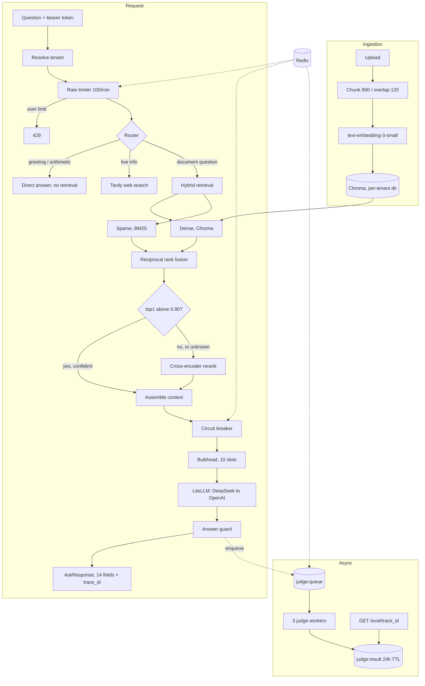
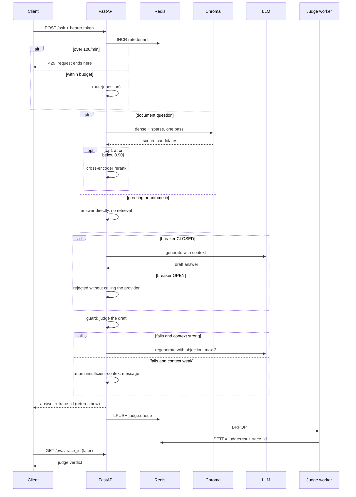
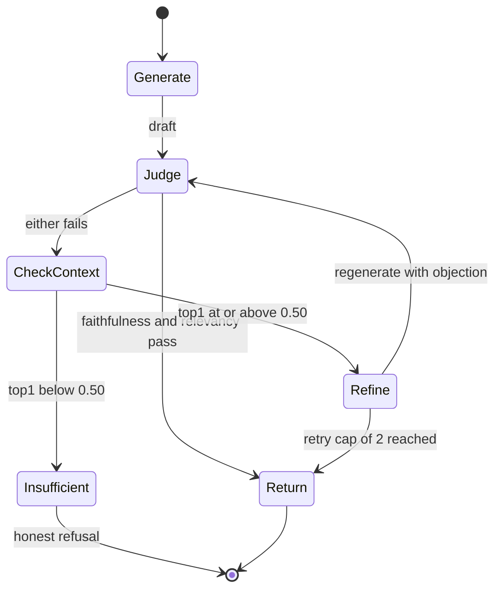
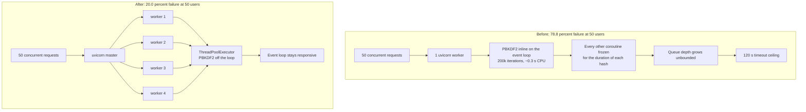
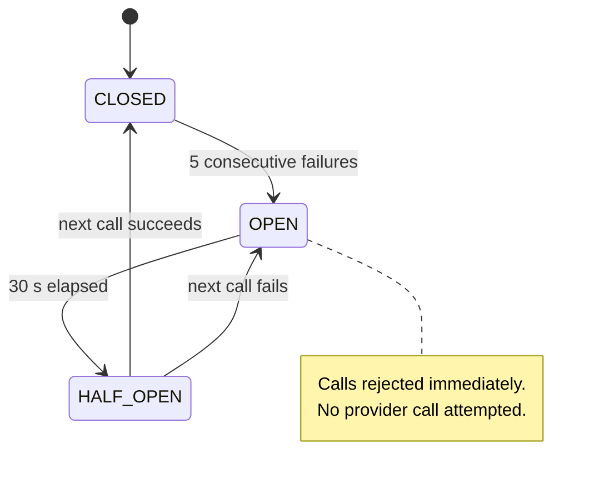
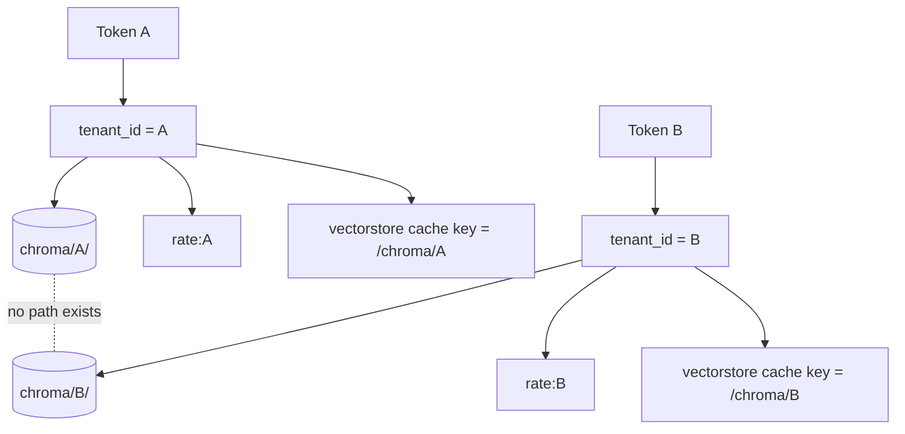
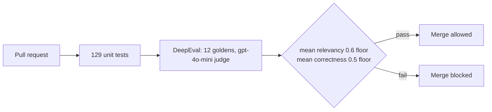

# Tessera — a multi-tenant RAG API that refuses to answer badly

A question-answering service over per-tenant document collections. It routes each question
to the cheapest strategy that can answer it, judges its own answers before returning them,
declines to refine when the evidence is too thin to refine against, and will not merge a
change that lowers answer quality.

Python · FastAPI · LangGraph · Redis · Chroma · DeepEval · Docker

[](tests/)
[](https://www.python.org/downloads/)

7,498 lines across 51 modules · 129 tests · 5 ADRs · 2 CI workflows

> **A note on the diagrams.** Every diagram is Mermaid, which GitHub renders natively.
> Where a sequence needs to show time passing it is drawn as a sequence diagram, and where
> a component has modes it is drawn as a state diagram, rather than flattening everything
> into one flowchart shape.

---

## Contents

- [What it does](#what-it-does)
- [Architecture](#architecture)
- [How a question is answered](#how-a-question-is-answered)
- [Why five strategies instead of one pipeline](#why-five-strategies-instead-of-one-pipeline)
- [The guard loop, and why it sometimes refuses to improve an answer](#the-guard-loop-and-why-it-sometimes-refuses-to-improve-an-answer)
- [Retrieval: a 900x slowdown that looked like slow LLM calls](#retrieval-a-900x-slowdown-that-looked-like-slow-llm-calls)
- [Conditional re-ranking: paying for the cross-encoder only when it can help](#conditional-re-ranking-paying-for-the-cross-encoder-only-when-it-can-help)
- [Concurrency: the API collapsed at 50 users and the cause was not the LLM](#concurrency-the-api-collapsed-at-50-users-and-the-cause-was-not-the-llm)
- [Three failure boundaries that fail in three different directions](#three-failure-boundaries-that-fail-in-three-different-directions)
- [Moving evaluation off the request path](#moving-evaluation-off-the-request-path)
- [Multi-tenancy: isolation at the index, not at the filter](#multi-tenancy-isolation-at-the-index-not-at-the-filter)
- [The evaluation gate](#the-evaluation-gate)
- [Evidence: what was measured](#evidence-what-was-measured)
- [Design decisions worth defending](#design-decisions-worth-defending)
- [Known limitations](#known-limitations)
- [Running it locally](#running-it-locally)
- [Configuration](#configuration)
- [Project layout](#project-layout)


---

## What it does

Ask a question against a tenant's documents. The system:

1. **Routes before it retrieves.** A greeting, a pure arithmetic expression, and a question
   about today's news do not all need a vector search. A heuristic router answers what it can
   locally and only escalates to an LLM classifier when it is genuinely unsure.
2. **Retrieves densely and sparsely, then fuses.** Chroma vector search and BM25 run against
   the same tenant index and are combined with reciprocal rank fusion, because embedding
   similarity misses exact identifiers and BM25 misses paraphrase.
3. **Re-ranks only when re-ranking can help.** A cross-encoder pass runs when top-1 dense
   similarity is at or below `0.90`, and is skipped when retrieval is already confident.
4. **Judges its own answer before returning it.** A cross-family `gpt-4o-mini` judge scores
   faithfulness and answer relevancy; a failing answer is regenerated with the judge's own
   objection as feedback, capped at 2 retries.
5. **Refuses to refine against weak evidence.** If the judge is unhappy *and* retrieval
   confidence was below `0.50`, the system returns an explicit insufficient-context message
   instead of a polished guess.
6. **Runs the judge off the request path.** Evaluation goes to a Redis queue drained by a
   bounded 3-worker pool, so scoring never competes with answering.
7. **Blocks merges on quality regressions.** DeepEval runs 12 goldens in CI against floors on
   mean relevancy and mean correctness.

---

## Architecture



Redis is the single coordination substrate: rate-limit counters, the judge queue, judge
results, circuit-breaker state, and the A2A checkpointer all live there. That is deliberate.
Each of those needs to be shared across API replicas, and adding a second store for any one
of them would mean a second thing to operate for no gain.

## How a question is answered



The important detail is the last four lines. The response is returned before the judge has
finished. A client that wants the score polls for it; a client that does not, never pays for it.

## Why five strategies instead of one pipeline

A single RAG pipeline charges every question the same price. Most questions do not need the
most expensive path, and a few need more than it.

| Strategy | What it does | When it earns its cost |
|---|---|---|
| `adaptive` | Hybrid retrieve, conditional rerank, guarded generate | The default; handles ordinary document questions |
| `corrective` | Detects weak retrieval and re-queries before generating | Retrieval returned something, but not something relevant |
| `cache` | Semantic cache keyed on query embedding, 6h TTL | Repeat and near-repeat questions, which real traffic is full of |
| `autonomous` | Multi-step tool use with an observation loop | Questions needing more than one retrieval to answer |
| `multi_agent` | Drafter and Judge as separate A2A agents | When drafting and judging should scale independently |

The semantic cache is keyed on the **embedding** of the query, not its text, so "what is the
refund window" and "how long do I have to return something" hit the same entry. It carries the
index mtime, so re-ingesting documents invalidates the cache rather than serving answers from
a corpus that no longer exists.

## The guard loop, and why it sometimes refuses to improve an answer



The branch that matters is `CheckContext`. The obvious design is: judge says no, so try again.
That is wrong when retrieval failed. Refining against weak context does not produce a better
answer, it produces a more confident-sounding wrong one, because the model has nothing new to
work from and only the instruction to try harder.

So when the judge fails an answer *and* top-1 retrieval similarity was below
`MIN_CONTEXT_CONFIDENCE_FOR_REFINE = 0.50`, the loop stops and returns an explicit statement
that the knowledge base does not cover the question. A refusal that is correct beats a
paragraph that is fluent.

Three further properties are enforced in code rather than assumed:

| Property | Why it is there |
|---|---|
| A metric counts toward gating only if it carries a boolean `passed` | A skipped or errored metric is an absent signal, not a failure. Treating "the judge did not run" as "the answer is bad" would trigger pointless regeneration. |
| The loop never mutates an answer to claim success | A gate that can rewrite its own verdict is not a gate. |
| The whole loop is wrapped, falling back to one un-guarded generation | A bug in quality checking must never turn a working endpoint into a 500. |

`run_strategy_fn` and `evaluate_fn` are injected rather than imported, so the guard module
imports neither the strategies nor the eval harness at load time and stays unit-testable in
isolation.

## Retrieval: a 900x slowdown that looked like slow LLM calls

This is the part of the project most worth being asked about, because it began as a
measurement that contradicted an assumption.

Phase 1 instrumentation reported `vector_retrieval` p50 at **3,696 ms**, p95 at 6,125 ms,
against a local Chroma index over a small corpus. That is 7 to 18 times what a local vector
lookup should cost.

**Without per-stage timing this would have been invisible.** End-to-end latency was roughly
10 seconds, which looks exactly like an ordinary slow LLM call, and the LLM was the assumed
suspect. Instrumenting each stage separately is what turned a vague "the API is slow" into a
single stage with an impossible number next to it.

Two compounding defects:

| Defect | Effect |
|---|---|
| `get_vectorstore()` reconstructed `OpenAIEmbeddings` and the `Chroma` handle on every call | Client construction and its setup cost were paid per request rather than per process |
| On the adaptive path it was called **twice per request** — once via `retrieve_hybrid`, once via `_top1_similarity` | Both the construction and the embedding round-trip were doubled, inside a single timer |

The second one is the interesting failure. `_top1_similarity` existed to answer "how confident
was retrieval" for the conditional re-rank gate, and the straightforward way to get that number
was to ask the vector store. That is a second network round-trip for a number the first
retrieval already computed and discarded.

The fix was two changes, neither large:

```python
def get_vectorstore() -> Chroma:
    key = str(active_index_dir())
    cached = _VECTORSTORE_CACHE.get(key)
    if cached is not None:
        return cached
    with _VECTORSTORE_LOCK:
        # Re-check inside the lock: another thread may have built it while we waited.
        cached = _VECTORSTORE_CACHE.get(key)
        if cached is not None:
            return cached
        vectorstore = _build_vectorstore()
        _VECTORSTORE_CACHE[key] = vectorstore
        return vectorstore
```

Cached **per tenant index directory**, not globally, so a cache hit can never hand one tenant
another tenant's store. The double-checked read around the lock keeps the common path
lock-free while still guaranteeing exactly one construction under a race — with four uvicorn
workers this is a real race, not a theoretical one.

Then `retrieve_hybrid(..., return_scores=True)` returns dense cosine scores from its first
pass, so `_top1_similarity` became a pure in-memory read of a tuple:

| Stage | Before p50 | After p50 | Delta |
|---|---|---|---|
| `vector_retrieval` | 3,696 ms | **4 ms** | about 900x |
| Client round-trip | 10,318 ms | **6,044 ms** | -4,274 ms |

Documents appearing only in the sparse arm have no dense score and are reported as `0.0`
rather than omitted, and any malformed input returns `SIMILARITY_UNKNOWN`, which routes to
running the re-ranker. A scoring problem degrades into doing more work, never into skipping
a quality step silently.

## Conditional re-ranking: paying for the cross-encoder only when it can help

A cross-encoder rerank (`ms-marco-MiniLM-L-6-v2`) scores every query-document pair with a
full forward pass. It measurably improves ordering when retrieval is ambiguous. It also costs
real latency on every single request, including the ones where the top hit was already correct.

The gate is one threshold:

| Condition | Action | Reasoning |
|---|---|---|
| No documents retrieved | Skip | Nothing to reorder; calling the model would only risk a crash |
| top-1 similarity **strictly above** `0.90` | Skip | Retrieval is already confident; reordering a correct first result cannot improve it |
| Similarity exactly at `0.90`, or unknown | **Run** | Ties and unknowns resolve toward doing the work |

The asymmetry at the boundary is deliberate. The skip requires strict inequality, so the
default under any uncertainty is to run the re-ranker. The cost of a needless rerank is
milliseconds; the cost of a wrongly skipped one is a wrong answer.

Measured effect: `reranking` p50 drops to **0.004 ms** on the confident path, because on most
requests the stage is a comparison rather than a model call. Every decision is written to the
structured trace with its reason, so the skip rate is auditable instead of assumed.

## Concurrency: the API collapsed at 50 users and the cause was not the LLM



Under load the API failed 78.8 percent of `/ask` requests at 50 users. The natural suspect was
the LLM, since those calls are the slowest thing in the system. The natural suspect was wrong.

Two compounding faults, neither in the RAG path at all:

1. **A single uvicorn worker** serialised every request through one Python process. Async
   concurrency multiplexes I/O waits; it does nothing for CPU work and nothing for a process
   that is saturated.
2. **PBKDF2 ran synchronously on the async event loop.** Password hashing at 200,000
   iterations is roughly 0.3 seconds of pure CPU. Running it inside an async handler blocks
   every other coroutine in that process for its entire duration. With 50 users logging in,
   the loop spent its life hashing while requests queued behind it.

The second is the one worth internalising. `async def` on a handler that performs CPU work is
not concurrency, it is a stall with a misleading keyword. PBKDF2 at 200k iterations is
*correct security engineering* — the cost is the point — which is exactly why it must not sit
on the loop.

Fix: four uvicorn workers for OS-level parallelism, and PBKDF2 moved to a dedicated
`ThreadPoolExecutor`, which releases the GIL during the hash because the work happens in
OpenSSL's C code.

| Metric | Pre-fix 50u | Post-fix 50u | Pre-fix 100u | Post-fix 100u |
|---|---|---|---|---|
| `/ask` failure rate | 78.8% | **20.0%** | 92.3% | **36.3%** |
| `/ask` p50 | 120,000 ms | **60,000 ms** | 120,000 ms | **53,000 ms** |
| `/ask` p95 | 121,000 ms | **102,000 ms** | 120,000 ms | 120,000 ms |
| `/auth/login` p50 | 66,000 ms | **22,000 ms** | 41,000 ms | 40,000 ms |
| `/auth/login` failures | 0 | 10 | 8 | **0** |
| Aggregated RPS | 0.76 | **0.90** | 0.92 | **1.63** |
| Requests completed | 166 | **220** | 228 | **484** |

Locust, 5 minutes per run, ramp 5 users/s, 120 s client timeout. Raw CSVs are committed under
`loadtest/results/`.

**The bottleneck moved rather than disappeared, and the numbers say where.** At 100 users
`/ask` p95 is still pinned at the 120 s ceiling. The failure breakdown from
`run_100_fixed_failures.csv` is 33 `ReadTimeout` and 70 `RemoteDisconnected`, which is no
longer an event-loop stall — it is the `gpt-4o-mini` round-trip itself, 5 to 30 seconds per
call, holding a worker for the duration. Three honest options remain: stream responses so a
worker is not held for the full generation, put `/ask` behind a job queue the way the judge
path already is, or add replicas. None is implemented, so none is claimed.

**A measurement caveat I am not hiding.** The load test's `on_start` calls `r.json()` on the
login response without checking status, so an empty body under pressure crashes the greenlet
and Locust exits non-zero. All 100 signup 400s in the results are expected — every virtual
user shares one account, so only the first signup can succeed. The CSVs are written regardless
and the latency data is real, but the harness has a bug and reporting the run without saying
so would misrepresent it.

## Three failure boundaries that fail in three different directions

Every request crosses three independent guards before it reaches a model. They are not three
copies of the same idea — each fails in the direction appropriate to what it protects.



| Guard | Mechanism | On its own failure | Why that direction |
|---|---|---|---|
| Rate limiter | Redis `INCR` + `EXPIRE`, one key per (tenant, minute) | **Fails open** — requests pass, warning logged | Redis being down should not take the API down. Losing rate limiting costs fairness; refusing all traffic costs availability. |
| Circuit breaker | Three-state, 5 failures to open, 30 s to probe | **Fails closed** — rejects without calling | Hammering a dead provider extends its outage and burns the caller's own latency budget on calls that cannot succeed. |
| Bulkhead | Counting semaphore, non-blocking acquire | **Rejects immediately** with 503 | Queueing indefinitely converts a capacity problem into a timeout problem, which is harder to diagnose and worse for the client. |

The breakers are **named**, so the LLM path and the judge path trip independently. A judge
provider outage must not open the breaker that answers questions. The bulkhead pools are sized
separately for the same reason: `MAIN_POOL_SIZE = 10` against `JUDGE_POOL_SIZE = 3`, so a
spike in evaluation work cannot consume the capacity that serves users.

The `HALF_OPEN` state is what makes this a circuit breaker rather than a kill switch. After
30 seconds exactly one probe call is allowed; success closes the circuit, failure reopens it
for another 30. Recovery needs no human.

## Moving evaluation off the request path

Judging an answer costs a second LLM round-trip of comparable latency to generating it.
Running it inline roughly doubles p95 on every request that is judged.

```mermaid
flowchart LR
    A[/ask] --> B[Generate]
    B --> C[Return with trace_id]
    B --> D{queue depth under 100?}
    D -->|yes| E[LPUSH job]
    D -->|no| F[503 + Retry-After: 60]
    E --> G[BRPOP, 3 workers]
    G --> H[(SETEX judge:result, 24h)]
    I[GET /eval/trace_id] --> H
```

Three decisions in that diagram:

- **Depth is bounded at 100.** An unbounded queue does not remove a capacity problem, it hides
  it until Redis runs out of memory. At the bound the API returns 503 with `Retry-After: 60`,
  which tells the client the truth and gives it something actionable.
- **`BRPOP`, not polling.** Workers block on the queue instead of waking on a timer, so an
  idle system costs nothing and a job is picked up the moment it lands.
- **Results carry a 24-hour TTL.** Judge verdicts are diagnostic, not the product. Expiring
  them bounds Redis memory without any cleanup job to operate.

`JUDGE_MODE` can be set to `sync` to restore blocking behaviour, which CI uses so the eval gate
is deterministic rather than racing a worker.

## Multi-tenancy: isolation at the index, not at the filter



The common approach is one collection with a `tenant_id` metadata filter on every query. It
works until one query is written without the filter, and that query returns another customer's
documents with no error and no log line.

Tessera gives each tenant its own Chroma persist directory. A missing filter cannot leak data
because there is no shared collection to leak from — the wrong index simply does not contain
the other tenant's vectors. Rate-limit keys and vectorstore cache keys are derived from the
same tenant context, so a cache hit cannot cross a boundary either. Isolation is asserted by a
committed artifact, `evals/reports/tenancy_isolation.json`, rather than by prose.

The cost is honest: per-tenant indexes mean more open handles and no cross-tenant corpus
sharing. At this tenant count that trade is clearly correct. At tens of thousands of tenants it
would need revisiting.

## The evaluation gate



| Metric | Mean | Pass rate | Gate floor |
|---|---|---|---|
| Answer relevancy | 0.917 | 11/12 | 0.6 mean |
| Correctness (GEval) | 0.786 | 11/12 | 0.5 mean |
| Faithfulness | 0.889 | 8/12 scored | 0.7 per case |
| Context precision | 1.000 | 12/12 | 0.7 per case |
| Context recall | 1.000 | 12/12 | 0.7 per case |

The judge is `gpt-4o-mini` while generation defaults to `deepseek-chat`. Cross-family
judging is the point: a model grading its own output shares its blind spots and its stylistic
preferences.

Faithfulness is scored on 8 of 12 cases because it is only defined when retrieval context
exists; the four direct-route cases have none. Scoring them as zero would punish correct
routing behaviour.

**One golden fails and stays in the report.** Case `g11`, on infrastructure-as-code drift, was
routed to the direct strategy with no context and answered "I do not know." That is a genuine
routing miss. It is left in because a suite that only ever shows green has stopped being a
measurement, and the fix is a router change, not a threshold change.

## Evidence: what was measured

| Measurement | Result | Source |
|---|---|---|
| Unit and integration tests | 129 passed, 0 errors | `tests/` |
| `vector_retrieval` p50, after fix | 4 ms (from 3,696 ms) | `docs/CASE_STUDY.md` |
| Client round-trip mean | 6,044 ms (from 10,318 ms) | `docs/CASE_STUDY.md` |
| LLM generation p50 / p95 | 2,943 ms / 3,965 ms | `docs/CASE_STUDY.md` |
| Embedding p50 / p95 | 215.9 ms / 1,005.9 ms | `docs/CASE_STUDY.md` |
| Reranking p50, confident path | 0.004 ms | `docs/CASE_STUDY.md` |
| Cost per question | $0.00025 | `evals/reports/metrics_summary.json` |
| Retrieval recall@5 | 1.00 | `evals/reports/metrics_summary.json` |
| Hallucination rate on goldens | 0.111 | `evals/reports/metrics_summary.json` |
| `/ask` failure rate at 50u | 20.0%, from 78.8% | `loadtest/results/run_50_fixed_stats.csv` |
| `/ask` failure rate at 100u | 36.3%, from 92.3% | `loadtest/results/run_100_fixed_stats.csv` |
| Aggregate throughput at 100u | 1.63 RPS, from 0.92 | `loadtest/results/run_100_fixed_stats.csv` |
| Cross-tenant leakage | none observed | `evals/reports/tenancy_isolation.json` |

Capacity projections in `docs/capacity-model.md` are modelled, not measured, and are labelled
as such there. At 10K requests/day with 3x peak the model says one API pod suffices and the
judge queue grows at +17.6 jobs/min until the 503 bound fires. At 1M/day every provider rate
limit is exceeded and draining the queue would need roughly 655 worker replicas — which is the
model's way of saying the architecture would need to change, not scale.

## Design decisions worth defending

**Instrumentation before optimisation.** The 900x retrieval win came from per-stage timers,
not from a clever algorithm. End-to-end latency pointed at the LLM, which was innocent. The
strongest single improvement in this project came from measuring the right thing, and that
ordering is the transferable lesson.

**Degrade in the direction that matches the risk.** The rate limiter fails open, the circuit
breaker fails closed, the bulkhead rejects immediately. Three different directions because
they protect three different things. Uniform failure policy is a smell.

**Never treat an absent signal as a negative one.** A skipped or errored judge metric leaves
`passed = None` and does not trigger regeneration. Systems that conflate "unknown" with "bad"
burn money on false alarms and eventually get their alerts ignored.

**A quality gate must not be able to rewrite its own verdict.** The guard loop can regenerate
an answer, but it can never mark a failing answer as passing. The moment a gate can adjust its
own result it stops being evidence.

**An honest refusal beats a confident guess.** Below 0.50 retrieval confidence the system says
it does not know. This is the decision most likely to be argued with in review, and the one I
would most defend: refining against weak context produces answers that are more fluent and no
more true, which is precisely the failure mode users cannot detect.

**Isolate at the boundary, not with a predicate.** Per-tenant indexes make cross-tenant leakage
structurally impossible rather than dependent on every query being written correctly.

**Cross-family judging.** A model grading its own output shares its own blind spots.

## Known limitations

**LLM latency is the live bottleneck at 100 users, and it is unfixed.** `/ask` p95 still hits
the 120 s ceiling. Streaming, a job queue for `/ask`, or replicas would each address it. None
is implemented and the numbers above show the ceiling rather than hiding it.

**Circuit-breaker state is per-pod.** The class supports Redis-backed shared state and falls
back to in-process, but the deployed path is in-process. With four workers, five failures must
accumulate within a single worker to open its breaker, so the effective threshold across the
pod is higher than the configured one. Noted in ADR-008; not yet closed.

**The Kubernetes manifests are written and reviewed, not deployed.** `k8s/` contains the HPA
on queue depth, a worker HPA, and a Redis exporter. They have not run against a live cluster,
so nothing here claims a production Kubernetes deployment.

**The load-test harness has a bug.** `on_start` calls `r.json()` unchecked, so Locust exits
non-zero even on runs that produced valid data. The latency numbers are real; the exit code is
not evidence of an API failure.

**Redis has no persistence configured.** It runs in a container with no volume and no AOF or
RDB. A restart loses queued judge jobs. Acceptable for evaluation work that can be re-run;
not acceptable if the queue ever carries anything a user is waiting on.

**One golden fails on routing.** `g11` is routed direct when it needed retrieval. Kept visible
in the report.

**Rate limiting is a fixed-window approximation.** One key per (tenant, minute) permits up to
2x the limit across a window boundary. A sliding log or token bucket would be exact at the
cost of more Redis operations per request. At 100 req/min the imprecision is not worth the
extra cost, and it is named here rather than described as a sliding window it is not.

**Secrets live in a `.env` file.** A real deployment needs a secret manager with rotation.

## Running it locally

```bash
docker compose up -d
curl http://127.0.0.1:8000/health
```

Use `127.0.0.1`, not `localhost`. On Windows, `dllhost.exe` intercepts the IPv6 loopback
(`::1`) before the request reaches the container, which surfaces as a connection failure that
looks like the container is down when it is running normally.

```bash
# Sign up, then ask
curl -X POST http://127.0.0.1:8000/auth/signup \
  -H "Content-Type: application/json" \
  -d '{"email":"you@example.com","password":"YourPass123!"}'
```

Run the tests:

```bash
uv run python -m pytest tests/ -q
```

Run the evaluation gate:

```bash
uv run python evals/run_eval.py
```

## Configuration

| Variable | Default | What it controls |
|---|---|---|
| `CHAT_MODEL` | `deepseek/deepseek-chat` | Generation model, via LiteLLM |
| `RETRIEVER_TOP_K` | `5` | Candidates returned per arm before fusion |
| `RERANK_SKIP_THRESHOLD` | `0.90` | Above this top-1 similarity, skip the cross-encoder |
| `MIN_CONTEXT_CONFIDENCE_FOR_REFINE` | `0.50` | Below this, refuse to refine instead of guessing |
| `JUDGE_MODE` | `async` | `sync` restores blocking judge for deterministic CI |
| `JUDGE_QUEUE_MAX_DEPTH` | `100` | Depth at which `/ask` returns 503 |
| `JUDGE_WORKER_CONCURRENCY` | `3` | Judge workers draining the queue |
| `RATE_LIMIT_PER_MINUTE` | `100` | Per-tenant request budget |
| `CIRCUIT_BREAKER_FAILURE_THRESHOLD` | `5` | Consecutive failures before opening |
| `CIRCUIT_BREAKER_RECOVERY_SECONDS` | `30` | Time in OPEN before a probe |
| `MAIN_POOL_SIZE` / `JUDGE_POOL_SIZE` | `10` / `3` | Bulkhead capacities |
| `CACHE_TTL_SECONDS` | `21600` | Semantic cache lifetime, 6 hours |
| `CHECKPOINTER_BACKEND` | `sqlite` | `redis` makes A2A replicas stateless |
| `MODEL_CANARY_PERCENT` | `0` | Traffic share routed to the canary model version |

Chunking is fixed at 800 characters with 120 overlap.

## Architecture decision records

| ADR | Decision |
|---|---|
| [007](docs/adr/ADR-007.md) | Redis judge queue with a bounded 3-worker pool |
| [008](docs/adr/ADR-008.md) | Rate limiting, circuit breaker, and bulkhead |
| [009](docs/adr/ADR-009.md) | Redis checkpointer for stateless A2A agents |
| [010](docs/adr/ADR-010.md) | HPA on queue depth rather than CPU for judge workers |
| [011](docs/adr/ADR-011.md) | Canary deployment for model version changes |

ADR-010 is the one worth reading. Autoscaling judge workers on CPU would never fire — they
spend their lives blocked on network I/O at near-zero utilisation, so the scaler would watch a
flat line while the backlog grew. Queue depth is the signal that actually tracks the work
waiting to be done.

## Project layout

```
.
├── src/
│   ├── api/            # FastAPI routes, tenancy, budget enforcement
│   ├── auth/           # PBKDF2 user store, bearer tokens
│   ├── rag/            # router, retrieval, rerank, strategies, guard, judge, checkpointer
│   ├── agents/         # A2A Drafter and Judge agent servers
│   ├── orchestrator/   # A2A supervisor
│   ├── resilience/     # rate limiter, circuit breaker, bulkhead
│   ├── security/       # async PBKDF2 thread pool
│   └── ui/             # Streamlit frontend
├── tests/              # 129 tests passing (see `uv run python -m pytest tests/ -q`)
├── evals/              # DeepEval harness, gate script, committed reports
├── goldens/            # 12 golden question-answer pairs
├── loadtest/           # Locust file, CSVs, comparison writeup
├── docs/               # case study, capacity model, ADRs
├── deploy/             # Dockerfile
├── k8s/                # HPA manifests (written, not deployed)
└── .github/workflows/  # eval gate + Docker smoke test
```

## Further reading

- [Case study](docs/CASE_STUDY.md) — problem framing, the decision record, evaluation
  evidence, the failure and recovery narrative, and an operational readiness checklist
- [Capacity model](docs/capacity-model.md) — modelled throughput at 10K and 1M requests/day
- [Load test comparison](loadtest/results/summary_concurrency_fix.md) — pre and post
  concurrency fix, with the bottleneck analysis

## Scope

This is a production-shaped system. It exercises the concerns of a real service — multi-tenant
isolation, rate limiting, circuit breakers, bounded worker pools, a merge-blocking evaluation
gate, container packaging, and load testing under concurrency — without having carried a real
user workload. Every number above traces to a committed file. Claims about scale stop where the
load tests stopped: 50 and 100 concurrent users, five minutes each.
