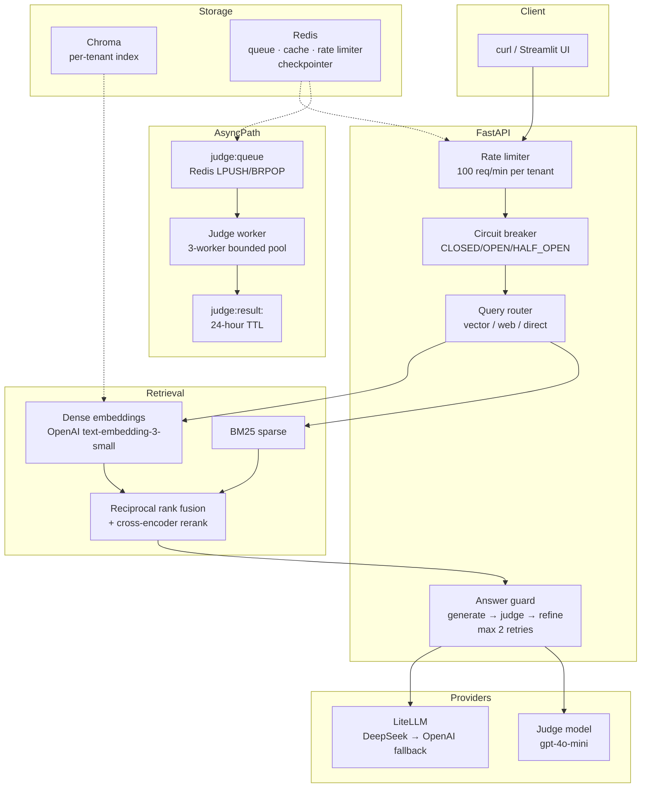

# Tessera

A multi-tenant RAG API with agentic orchestration, a runtime quality gate, and production-grade reliability patterns. Python, FastAPI, LangGraph, Redis, DeepEval.

[](tests/)
[](https://www.python.org/downloads/)
[](LICENSE)

---

## What it does

- Multi-tenant document Q&A over per-tenant Chroma indexes; cross-tenant document leakage is prevented and verified by a committed isolation proof (`evals/reports/tenancy_isolation.json`)
- Agentic generate-judge-refine loop over the Google A2A protocol, capped at 2 refinements to bound worst-case latency; judge feedback is fed back into the next draft prompt rather than retrying blindly
- Merge-blocking evaluation gate in CI (DeepEval, G-Eval custom criteria, golden set of 12 cases); the gate checks mean answer relevancy >= 0.6 and mean correctness >= 0.5
- Redis-backed judge queue with a bounded 3-worker pool (`JUDGE_WORKER_CONCURRENCY=3`); queue overflow returns HTTP 503 with `Retry-After: 60` instead of silently dropping work
- Per-tenant rate limiting: 100 req/min per tenant, Redis sliding-window, HTTP 429 on breach
- Three-state circuit breaker (CLOSED/OPEN/HALF_OPEN) around the LLM provider call, plus bulkhead isolation separating the primary LLM connection pool (10 slots) from the judge pool (3 slots)
- 113 tests passing: request path, resilience patterns (circuit breaker, bulkhead, rate limiter, checkpointer, queue), tenant isolation, conditional refinement, semantic cache, streaming, and observability

---

## Architecture



**Async judging path.** `/ask` returns as soon as the answer is generated. A `trace_id` is included in the response; the caller polls `/eval/{trace_id}` to retrieve the judge result. The judge worker drains the Redis queue with a bounded 3-worker pool; queue overflow returns HTTP 503 rather than growing unbounded.

---

## Measured results

All figures come from committed report files. Sources are listed in the table.

| Metric | Value | Source |
|---|---|---|
| Retrieval p50 after vectorstore cache fix | 4 ms | `docs/CASE_STUDY.md` Phase 3 |
| Retrieval p50 before fix | 3,696 ms | `docs/CASE_STUDY.md` Phase 1 baseline |
| Client round-trip mean | 6,044 ms | `docs/CASE_STUDY.md` Phase 3 |
| LLM generation p50 | 2,943 ms | `docs/CASE_STUDY.md` Phase 3 |
| Cost per question | $0.00025 | `evals/reports/metrics_summary.json` |
| 50-user `/ask` failure rate — post concurrency fix | 20.0% | `loadtest/results/run_50_fixed_stats.csv` |
| 50-user `/ask` failure rate — pre-fix (single-worker) | 78.8% | `loadtest/results/run_50_openai_stats.csv` |
| 100-user aggregated throughput — post-fix | 1.63 RPS | `loadtest/results/run_100_fixed_stats.csv` |

**CI eval gate results** (12 golden questions, gpt-4o-mini judge, `evals/reports/latest.json`):

| Metric | Mean | Pass rate | Gate threshold |
|---|---|---|---|
| Answer relevancy | 0.917 | 11/12 | 0.6 mean |
| Correctness (GEval) | 0.786 | 11/12 | 0.5 mean |
| Faithfulness | 0.889 | 8/12 scored | 0.7 per case |
| Context precision | 1.000 | 12/12 | 0.7 per case |
| Context recall | 1.000 | 12/12 | 0.7 per case |

Faithfulness is only defined when a case has retrieval context; five direct-route cases are excluded. One golden case (`g11`, infrastructure-as-code drift) was routed to the direct strategy with no context and answered "I do not know" — a real routing miss, kept in the report rather than removed.

---

## Key design decisions

- **[ADR-007](docs/adr/ADR-007.md): Redis judge queue with bounded 3-worker pool** — moves evaluation off the request path so judge calls cannot starve answer generation, and makes in-flight jobs durable across pod restarts
- **[ADR-008](docs/adr/ADR-008.md): Rate limiting, circuit breaker, and bulkhead** — three independent resilience patterns implemented in-process; each degrades gracefully (fail-open, 503, immediate rejection) rather than cascading
- **[ADR-009](docs/adr/ADR-009.md): Redis checkpointer for A2A agent state** — makes API replicas stateless so any pod can resume any A2A workflow thread, replacing the Phase 4 SQLite checkpointer
- **[ADR-010](docs/adr/ADR-010.md): HPA on Redis queue depth for judge workers** — CPU utilisation stays near zero for I/O-bound workers; queue depth is the metric that actually tracks backlog
- **[ADR-011](docs/adr/ADR-011.md): Canary deployment for model version changes** — routes a configurable percentage of traffic by deterministic tenant hash so a bad model version affects at most `MODEL_CANARY_PERCENT`% of requests before rollback

---

## Running locally

```bash
docker compose up -d
curl http://127.0.0.1:8000/health
```

Note: use `127.0.0.1`, not `localhost`. On Windows, `dllhost.exe` intercepts the IPv6 loopback (`::1`) before the request reaches the container, causing connection failures.

---

## Project structure

```
.
├── src/
│   ├── api/          # FastAPI routes, tenancy, budget enforcement
│   ├── auth/         # PBKDF2 user store, bearer token middleware
│   ├── rag/          # retrieval, reranking, guard loop, checkpointer, LLM wrapper
│   ├── agents/       # A2A Drafter and Judge agent servers
│   ├── orchestrator/ # A2A supervisor (Drafter → Judge → refine loop)
│   ├── resilience/   # rate limiter, circuit breaker, bulkhead
│   ├── security/     # async PBKDF2 thread pool wrapper
│   └── ui/           # Streamlit frontend
├── tests/            # 113 tests
├── evals/            # DeepEval harness, gate script, committed reports
├── goldens/          # 12 golden question-answer pairs
├── loadtest/         # Locust locustfile and CSV results
├── docs/             # Case study, capacity model, ADRs
├── deploy/           # Dockerfile, legacy docker-compose for A2A mode
├── k8s/              # HPA manifests (written, not deployed)
├── .github/workflows/ # CI: eval gate + Docker smoke test
└── docker-compose.yml # Redis + API + judge worker
```

---

## Further reading

- [Project Case Study](docs/CASE_STUDY.md) — problem definition, architecture decisions, evaluation evidence, failure and recovery narrative, operational readiness checklist
- [Architecture Decision Records](docs/adr/) — ADR-007 through ADR-011, each in Nygard format with context, decision, alternatives considered, and consequences
- [Capacity Model](docs/capacity-model.md) — throughput and resource projections at 10K and 1M requests/day

---

## Scope

This is a production-shaped system: it exercises the concerns of a real service — rate limiting, circuit breakers, bounded worker pools, an evaluation gate in CI, container packaging, load-tested under concurrency — without having carried a real user workload. The case study documents what is measured and what is not. Claims about scale are bounded to what the load tests actually ran: 50 and 100 concurrent users.

---

## License

MIT. See [LICENSE](LICENSE).
